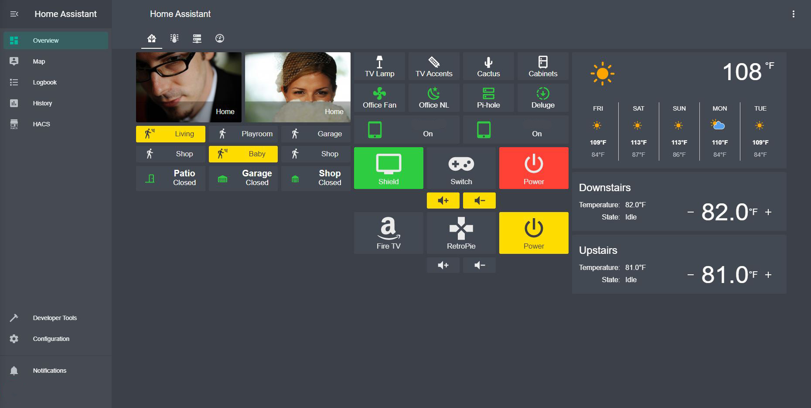
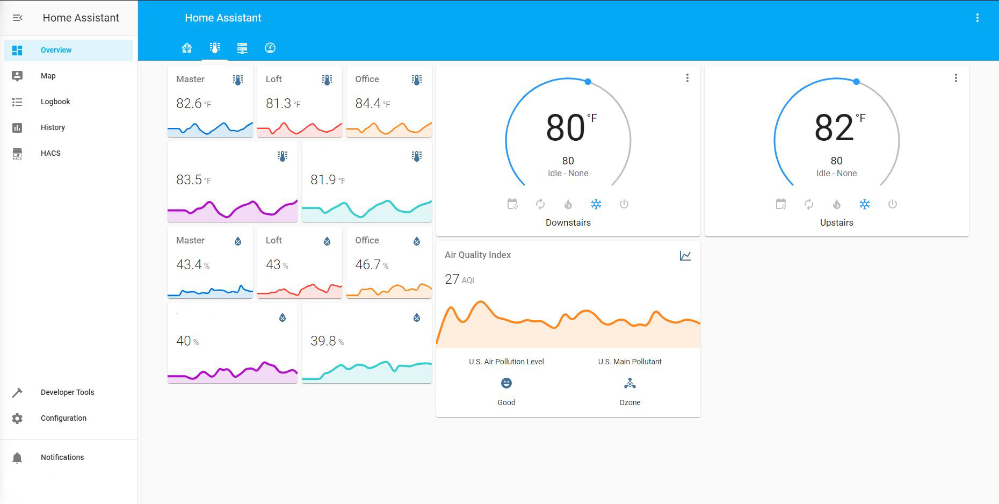
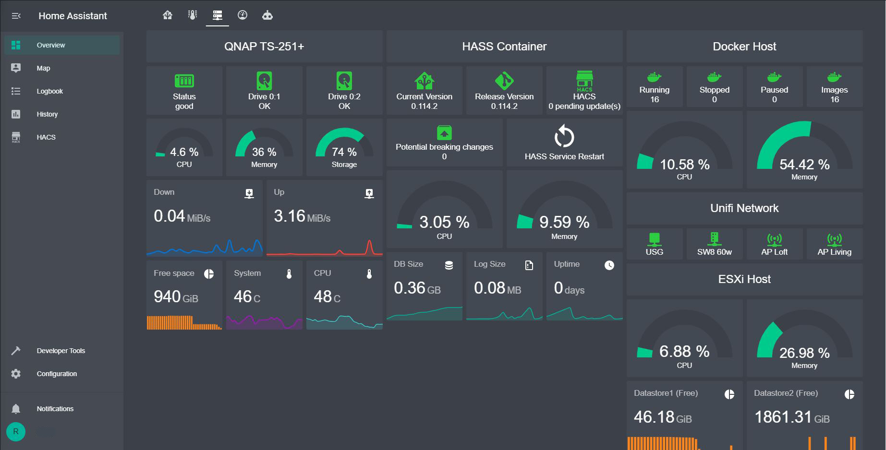
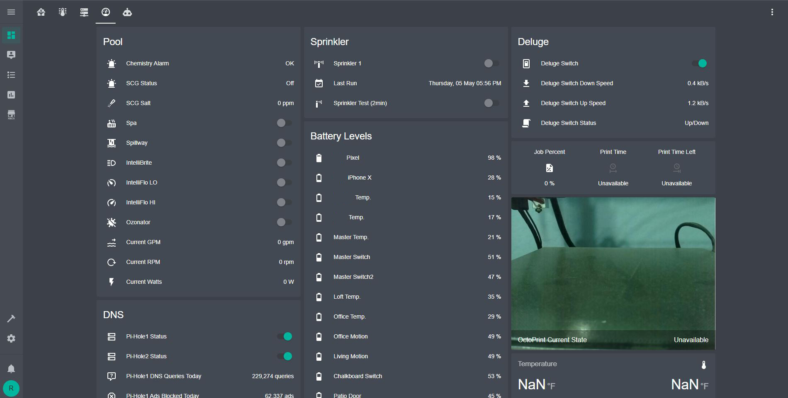
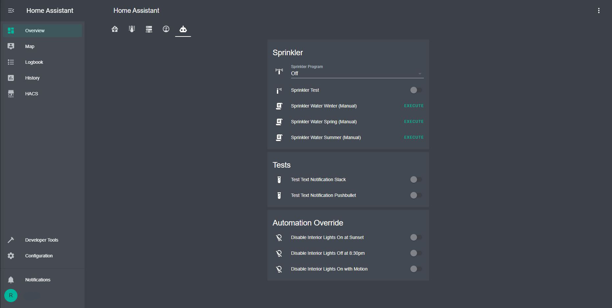

<h1 align="center">
  Home Assistant Config by ntalekt
</h1>
<h4 align="center">Be sure to :star: my repo so you can keep up to date on the progress!</h4>

  <h4>
    
    
    
	
  </h4>

This is my <a href="https://home-assistant.io">Home Assistant</a> configuration which is running on Docker. When starting with home automation I found many well documented configurations and drew inspiration from them in order to achieve my automation goals. I wanted to share my success with the community and hopefully help others on their journey.

#### Platform
* Hardware
  * [HP Z620 - E5-2650 8C, 64GB ECC](https://www.ebay.com/sch/i.html?_from=R40&_trksid=p2334524.m570.l1313&_nkw=z620+e5-2650+64gb&_sacat=0&LH_TitleDesc=0&_odkw=z620+e5-2650&_osacat=0&LH_PrefLoc=2)
  * [QNAP TS-251+](https://www.qnap.com/en-us/product/ts-251+)
  * [Sonoff Zigbee 3.0 USB CC2652P](https://amzn.to/3m8EDRj)
* Software
  * [vSphere 7.x](https://docs.vmware.com/en/VMware-vSphere/7.0/rn/vsphere-esxi-vcenter-server-70-release-notes.html)
  * [Docker v24.0.2](https://github.com/docker/docker-ce/releases)
  * [homeassistant/home-assistant](https://hub.docker.com/r/homeassistant/home-assistant)
  * [Traefik v2.2.1 proxy](https://www.smarthomebeginner.com/traefik-2-docker-tutorial/)
  * SSL via [Let's Encrypt](https://letsencrypt.org/)
  * [Zigbee Home Automation (ZHA)](https://www.home-assistant.io/integrations/zha/)
  * [Mariadb](https://hub.docker.com/r/linuxserver/mariadb)
  * [Mosquitto MQTT](https://hub.docker.com/_/eclipse-mosquitto)
  
# Interface

## Devices

#### Lighting
* [Kasa HS220 Wi-Fi Switch](https://amzn.to/40IepE8) x3
* [Yeelight Wi-Fi RGB Strip](https://amzn.to/40Mo6kU) x2
* [LE LampUX RGB Lamp](https://amzn.to/414IKfT)
* [Goldwin Wi-Fi Controller](https://amzn.to/3nOkGjh)
  * [Used with Under Cabinet LED](https://amzn.to/3m3yHsU)
* [Pentair IntelliBrite](https://www.pentair.com/en-us/products/residential/pool-spa-equipment/pool-lighting/intellibrite_5g_underwatercolor-changingledpoolandspalights.html)
* [Govee H7012 Outdoor Patio String Lights](https://amzn.to/40LW5dh)
* [Govee H7061 RGBIC Flood Lights](https://amzn.to/3Ki6d6N) x2
* [Govee H6008 RGBWW Light Bulbs](https://amzn.to/3KEClCZ) x8
* [Govee H7065 RGBIC Spot Lights](https://amzn.to/3twCRgf) x2
* [Zigbee Controller](https://www.aliexpress.us/item/3256804444208373.html)

#### Outlets / Switches
* [Sonoff S31 WiFi w/tasmota](https://amzn.to/3KzEDDh) x3
* [Sonoff S31 Lite Zigbee](https://amzn.to/434kBbn) x4
* [Aqara Wireless Mini Switch](https://amzn.to/40LWP23) x4
* [Kasa EP40 Wi-Fi Outlet](https://amzn.to/3P6kF5k)
* ~~[Wyze Plug Outdoor](https://amzn.to/40Cpd6N)~~

#### Sensors
* [Aqara Motion Sensor](https://amzn.to/3zU7xbf) x2 (Office/Living)
* [Aqara Temperature Humidity Sensor](https://amzn.to/4175Suu) x5
* [Aqara Leak Sensor](https://amzn.to/3meBoYz) x4
* [Aqara Window Door Sensor](https://amzn.to/40Cpzu9) x2
* [Ikea Vindriktning PM2.5 ESP8266](https://www.briandorey.com/post/monitoring-air-quality-home-assistant) x5
  * [Ikea Vindriktning Sensor](https://www.ikea.com/us/en/p/vindriktning-air-quality-sensor-60515911/)
  * [ESP8266 Module](https://amzn.to/3GnjAkS)

#### Camera
* [Tapo C320WS](https://amzn.to/3MdR6Oi) x6
* [Tapo C110](https://amzn.to/3ZJA3GP) x2
* [Ring Pro Doorbell](https://amzn.to/3Kdnj5t)
* [Ring Stick Up Cam Battery](https://amzn.to/3RZQXAX)

#### Media
* [Amazon Echo Dot 3rd Gen](https://amzn.to/3Gn41tg) x3 (via [Emulated Hue Bridge](https://home-assistant.io/components/emulated_hue/))
* [Amazon Echo Show 5 1st Gen](https://amzn.to/3Glb9GP) (via [Emulated Hue Bridge](https://home-assistant.io/components/emulated_hue/))
* [Sonos PLAY:1](https://amzn.to/3Gm9Dnw) x3
* [Sonos One](https://amzn.to/3ZLBe8N)
* [Harmony Hub](https://amzn.to/3meKzZ6) x2
* [NVIDIA SHIELD TV Pro](https://amzn.to/40MhUcD) x3
* [Samsung 85” TV (QN90B)](https://amzn.to/3MtvvkK)
* [LG 65" TV (65UH8500)](https://www.lg.com/us/tvs/lg-65UH8500-4k-uhd-tv)

#### Irrigation
* [Rain Bird ST8O-2.0](https://amzn.to/434dP5n)

#### Climate/Air Quality
* [Trane XL824](https://amzn.to/3GlbVUf) x2
* [Pentair EasyTouch Pool/Spa Controller](https://www.pentair.com/en-us/products/residential/pool-spa-equipment/pool-automation/easytouch_controlsystems.html)
* [Govee H7121 Air Purifier](https://amzn.to/3nRNVBv)

#### Garage/Cover
* [Chamberlain B2405 Smart Garage Door Opener](https://amzn.to/40IVXet)

#### Network
* [Ubiquiti Unifi Security Gateway (USG)](https://amzn.to/3KzHeNx)
* [Ubiquiti UniFi Switch 8 60W (US-8-60W)](https://amzn.to/3Gmca15)
* [Ubiquiti UniFi6 Pro Access Point (U6-Pro-US)](https://amzn.to/3UfDnbq)
* [Ubiquiti UniFi Access Point (UAP-AC-PRO-US)](https://amzn.to/3MhaF8k) x2
* [Ubiquiti UniFi6 Access Point U6 Mesh (U6-Mesh-US)](https://amzn.to/3UcEnNC)

#### Other Hardware
* [QNAP TS-251+](https://www.qnap.com/en-us/product/ts-251+)
* [Sonoff Zigbee 3.0 USB CC2652P](https://amzn.to/3m8EDRj)
* [APC APC BX1500M](https://amzn.to/3ZFKZ8s)

#### Software
* [Life360 Location Tracking App](https://www.life360.com/)
* [Pi-hole](https://pi-hole.net/)
* [Frigate NVR](https://docs.frigate.video)
* [double-take](https://github.com/jakowenko/double-take)

## Example Automations
### Notification Audio
* [TTS](https://home-assistant.io/components/tts.google/) notification when _User_ arrives at specific [Zones](https://home-assistant.io/components/zone/)
* [TTS](https://home-assistant.io/components/tts.google/) notification when _User_ leaves specific zones which includes travel time home
* [TTS](https://home-assistant.io/components/tts.google/) notification if the garage door has been open for 30 minutes with no motion in garage
* [TTS](https://home-assistant.io/components/tts.google/) school bell notification (if remote schooling mode enabled)
* [TTS](https://home-assistant.io/components/tts.google/) test notification
* [TTS](https://home-assistant.io/components/tts.google/) ring ding & motion events

### Notification Text
* [Slack](https://www.home-assistant.io/integrations/slack) notification when new Home Assistant version is available on PyPI
* [Slack](https://www.home-assistant.io/integrations/slack) notification when critical network devices go offline
* [Slack](https://www.home-assistant.io/integrations/slack) notification if the garage door is left open after we left the house
* [Slack](https://www.home-assistant.io/integrations/slack) notification if the garage door is opened and no one is home
* [Slack](https://www.home-assistant.io/integrations/slack) notification if the garage door has been open for 30 minutes with no motion in garage
* [Slack](https://www.home-assistant.io/integrations/slack) notification test
* [Slack](https://www.home-assistant.io/integrations/slack) when any battery sensor falls below 20%
* [Slack](https://www.home-assistant.io/integrations/slack) for a failed login attempt
* [Slack](https://www.home-assistant.io/integrations/slack) if new network device is detected

### Lights
* Exterior lights (porch, side entrance, pool, landscape) on 5 minutes before sunset.
* Exterior lights dim to 15% at 9:00pm
* Exterior pool lights off if no motion after 10pm
* Interior under cabinet transition during sunset
* Interior lights off if no motion
* Interior lights on if motion

### Doorbell
* Exterior lights to 100% if [Ring Pro Doorbell](https://amzn.to/3Kdnj5t) detects motion or is pressed after 9:00pm
* Exterior lights back to 15% after 30 minutes after doorbell motion or press

### Media
* Start [Harmony Hub](https://amzn.to/3meKzZ6) activity if user selects from HA UI 
* Update `input_select` status if physical [Harmony Hub](https://amzn.to/3meKzZ6) remote is used to start activity
* Start playing music on [Sonos PLAY:1](https://amzn.to/3ZLBe8N) speakers if user selects music station from `input_select`.
* Start playing music on [Sonos PLAY:1](https://amzn.to/3ZLBe8N) speakers if user starts music station using [Amazon Echo Dot](https://www.amazon.com/gp/product/B01DFKC2SO/ref=as_li_tl?ie=UTF8&camp=1789&creative=9325&creativeASIN=B01DFKC2SO&linkCode=as2&tag=ntalekt0c-20&linkId=bb902528d5689ae4e1163dd31b7c646d) via [Emulated Hue Bridge](https://home-assistant.io/components/emulated_hue/)
* Start [Harmony Hub](https://amzn.to/3meKzZ6) activity using [Amazon Echo Dot](https://amzn.to/3Gn41tg) via [Emulated Hue Bridge](https://home-assistant.io/components/emulated_hue/)
* Power off [Harmony Hub](https://amzn.to/3meKzZ6) activity using [Amazon Echo Dot](https://amzn.to/3Gn41tg) via [Emulated Hue Bridge](https://home-assistant.io/components/emulated_hue/)
* Turn on SleepTime mode if [Xiaomi Aqara Smart Wireless Switch](https://amzn.to/40LWP23) is pressed
* Pause [Deluge](https://home-assistant.io/components/switch.deluge/) if internet data usage > 90%

### Sonos
* Reset/Regroup all [Sonos PLAY:1](https://amzn.to/3ZLBe8N) speakers at 6:00am every morning
* Group all Sonos' button

### Occupancy
* If motion is detected via Aquara Motion or [Tapo cameras, Frigate object detection](https://amzn.to/3MdR6Oi) turn on `input_boolean` (used in `binary_sensor` for occupancy tracking)
* If no motion is detected after certain period of time turn off `input_boolean`.

### Sleep time
* If [Aqara Wireless Mini Switch](https://amzn.to/40LWP23) pressed turn off master TV after 30 minutes via [Harmony Hub](https://amzn.to/3meKzZ6), turn off loft lamp, and put office air purifier to sleep. 

### System
* Clean the TTS cache weekly

### Vacation/Climate
* Turn vacation mode on when household is gone for 24 hours.
* Toggle office fan on/off based on occupancy using [Sonoff S31 Lite Zigbee](https://amzn.to/434kBbn)
* Turn office air purifier [Govee H7121 Air Purifier](https://amzn.to/3nRNVBv) on/off based on occupancy
* Turn office air purifier [Govee H7121 Air Purifier](https://amzn.to/3nRNVBv) on/off based on air quality sensor
* Change office air purifier [Govee H7121 Air Purifier](https://amzn.to/3nRNVBv) mode based on air quality sensor