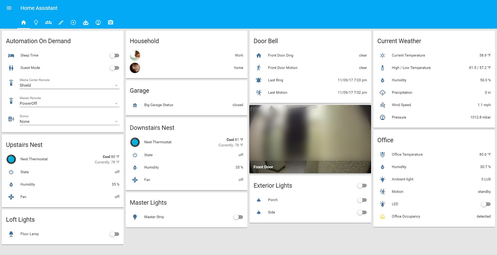
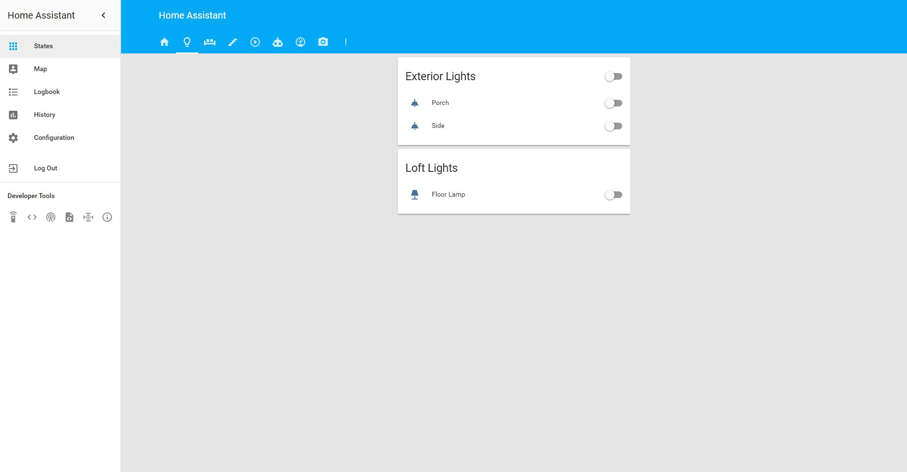
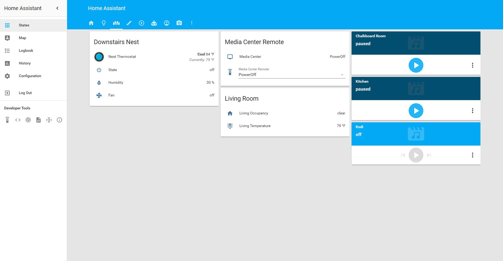
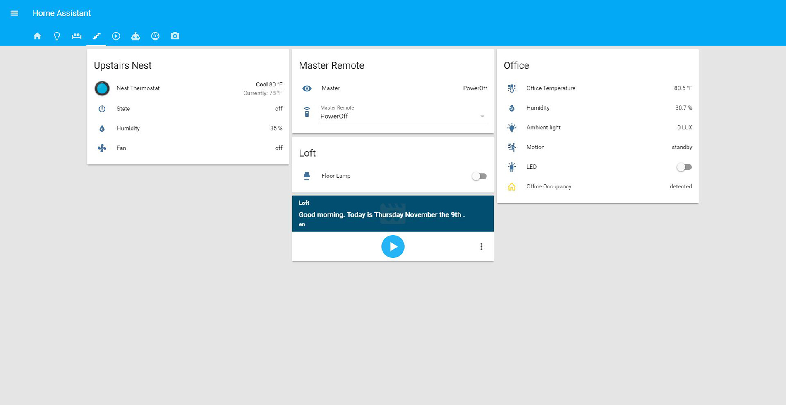
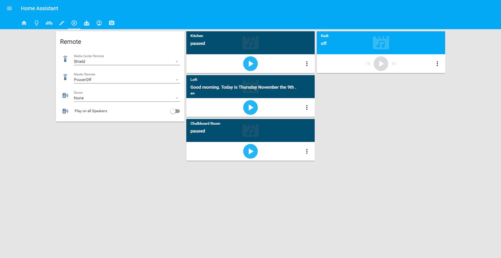
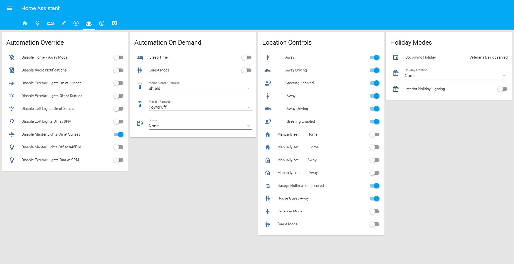
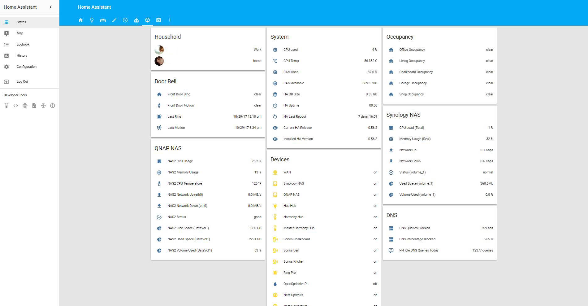
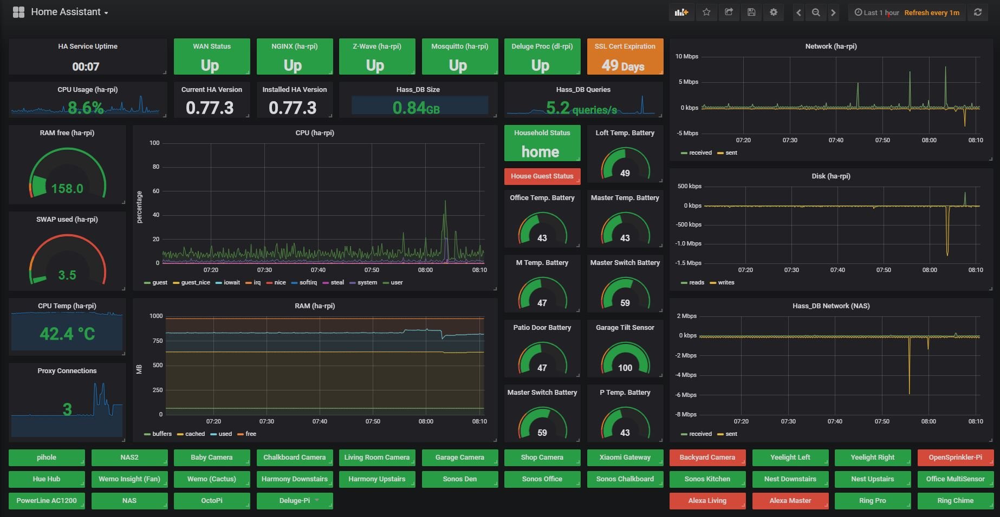

<h1 align="center">
  Home Assistant Config by ntalekt
</h1>
<h4 align="center">Be sure to :star: my repo so you can keep up to date on the progress!</h4>

  <h4>
    
    
    
  </h4>

This is my <a href="https://home-assistant.io">Home Assistant</a> configuration which is running on a <a href="https://www.amazon.com/gp/product/B01CD5VC92/ref=as_li_tl?ie=UTF8&camp=1789&creative=9325&creativeASIN=B01CD5VC92&linkCode=as2&tag=ntalekt0c-20&linkId=a47341c555e64a096e2d9eb9af323626">Raspberry Pi 3</a> running <a href="https://home-assistant.io/docs/installation/hassbian/installation/">Hassbian</a>. When starting with home automation I found many well documented configurations and drew inspiration from them in order to achieve my automation goals. I wanted to share my success with the community and hopefully help others on their journey.

#### Platform
* Hardware
  * [Raspberry PI 3 Model B](https://www.amazon.com/gp/product/B01CD5VC92/ref=as_li_tl?ie=UTF8&camp=1789&creative=9325&creativeASIN=B01CD5VC92&linkCode=as2&tag=ntalekt0c-20&linkId=a47341c555e64a096e2d9eb9af323626)
  * [SanDisk Ultra 32GB microSDHC](https://www.amazon.com/gp/product/B073JWXGNT/ref=as_li_tl?ie=UTF8&camp=1789&creative=9325&creativeASIN=B073JWXGNT&linkCode=as2&tag=ntalekt0c-20&linkId=efa468860daf18e843eadc5ee34729c7)
  * [Aeotec Z-Stick Gen5](https://www.amazon.com/gp/product/B00X0AWA6E/ref=as_li_tl?ie=UTF8&camp=1789&creative=9325&creativeASIN=B00X0AWA6E&linkCode=as2&tag=ntalekt0c-20&linkId=04f4c7bf8438a9dee6e4e2ad273405d0)
* Software
  * [Home Assistant Hassbian v1.31 (Python 3.5.3)](https://www.home-assistant.io/docs/installation/hassbian/installation/)
    * Home Assistant Version: 0.77.1
  * [NGNIX proxy](https://home-assistant.io/docs/ecosystem/nginx/)
  * SSL via [SSLs](https://www.ssls.com/)

## Devices
#### Climate
* [Nest Thermostat](https://www.amazon.com/gp/product/B0131RG6VK/ref=as_li_tl?ie=UTF8&camp=1789&creative=9325&creativeASIN=B0131RG6VK&linkCode=as2&tag=ntalekt0c-20&linkId=07e1a8fdb9abf017c692614b74df561d) x2

#### Lighting
* [Hue Hub](https://www.amazon.com/gp/product/B016H0QZ7I/ref=as_li_tl?ie=UTF8&camp=1789&creative=9325&creativeASIN=B016H0QZ7I&linkCode=as2&tag=ntalekt0c-20&linkId=dfb13129d738cafa48b503294db1c058)
* [Hue White Ambiance Bulb](https://www.amazon.com/gp/product/B0753H5GKN/ref=as_li_tl?ie=UTF8&camp=1789&creative=9325&creativeASIN=B0753H5GKN&linkCode=as2&tag=ntalekt0c-20&linkId=9a392ecd3068075cfa88185a6fccc3df)
* [Hue White Bulb](https://www.amazon.com/gp/product/B073SSK6P8/ref=as_li_tl?ie=UTF8&camp=1789&creative=9325&creativeASIN=B073SSK6P8&linkCode=as2&tag=ntalekt0c-20&linkId=97fe4a915d8f531a8ce6697ee55f056c) x4
* [Yeelight WIFI RGB Strip](https://www.amazon.com/gp/product/B01LRT0B56/ref=as_li_tl?ie=UTF8&camp=1789&creative=9325&creativeASIN=B01LRT0B56&linkCode=as2&tag=ntalekt0c-20&linkId=34a9570cd0c747f448092913ac2dae60) x2
* [GE Z-Wave Plus Dimmer 14294](https://www.amazon.com/gp/product/B01MUCZA1C/ref=as_li_tl?ie=UTF8&camp=1789&creative=9325&creativeASIN=B01MUCZA1C&linkCode=as2&tag=ntalekt0c-20&linkId=0dfbcad4a9df3b81570623f0e23b562a) x3

#### Sensor / Switch
* [Ecolink Z-wave Plus Garage Door Tilt Sensor](https://www.amazon.com/gp/product/B01MRZB0NT/ref=as_li_tl?ie=UTF8&camp=1789&creative=9325&creativeASIN=B01MRZB0NT&linkCode=as2&tag=ntalekt0c-20&linkId=ba6f517d4382e6a23be0479e15d3ce2f)
* [BRUH Automation Multisensor](https://github.com/bruhautomation/ESP-MQTT-JSON-Multisensor)
* [Xiaomi Mi Smart Gateway](https://www.gearbest.com/living-appliances/pp_344667.html)
* [Xiaomi Aqara Temperature Humidity Sensor](https://www.gearbest.com/access-control/pp_626702.html) x5
* [Xiaomi Aqara Window Door Sensor](https://www.gearbest.com/access-control/pp_626703.html)
* [Xiaomi Aqara Smart Wireless Switch](https://www.gearbest.com/access-control/pp_626695.html) x2
* [Wemo Mini Smart Plug](https://www.amazon.com/gp/product/B01NBI0A6R/ref=as_li_tl?ie=UTF8&camp=1789&creative=9325&creativeASIN=B01NBI0A6R&linkCode=as2&tag=ntalekt0c-20&linkId=b8975bef5cfef090873209417be305fa)
* [Wemo Insight Smart Plug](https://www.amazon.com/gp/product/B01DBXNYCS/ref=as_li_tl?ie=UTF8&camp=1789&creative=9325&creativeASIN=B01DBXNYCS&linkCode=as2&tag=ntalekt0c-20&linkId=934f0720129cf096876ab8b14a26bbbb)

#### Camera
* [Amcrest IP3M-943W Camera](https://www.amazon.com/gp/product/B01I01Z1M2/ref=as_li_tl?ie=UTF8&camp=1789&creative=9325&creativeASIN=B01I01Z1M2&linkCode=as2&tag=ntalekt0c-20&linkId=2ef3afe981c97da79ba37bf3815f7347)
* [Amcrest IPM-HX1W Camera](https://www.amazon.com/gp/product/B077DPWQCV/ref=as_li_tl?ie=UTF8&camp=1789&creative=9325&creativeASIN=B077DPWQCV&linkCode=as2&tag=ntalekt0c-20&linkId=ac62ed590e7bb7ab3e4aca12348c1db1) x4
* [Hikvision DS-2CD2032-I Camera](https://www.amazon.com/gp/product/B00G7GMEOG/ref=as_li_tl?ie=UTF8&camp=1789&creative=9325&creativeASIN=B00G7GMEOG&linkCode=as2&tag=ntalekt0c-20&linkId=6033949532ab30894bc0ef3dfb3e4757)
* [Ring Pro Doorbell](https://www.amazon.com/gp/product/B01DM6BDA4/ref=as_li_tl?ie=UTF8&camp=1789&creative=9325&creativeASIN=B01DM6BDA4&linkCode=as2&tag=ntalekt0c-20&linkId=5faec88af320aeb157fbb45fa954efc3)

#### Media
* [Amazon Echo Dot](https://www.amazon.com/gp/product/B01DFKC2SO/ref=as_li_tl?ie=UTF8&camp=1789&creative=9325&creativeASIN=B01DFKC2SO&linkCode=as2&tag=ntalekt0c-20&linkId=bb902528d5689ae4e1163dd31b7c646d) x2 (via [Emulated Hue Bridge](https://home-assistant.io/components/emulated_hue/))
* [Sonos PLAY:1](https://www.amazon.com/gp/product/B00EWCUK1Q/ref=as_li_tl?ie=UTF8&camp=1789&creative=9325&creativeASIN=B00EWCUK1Q&linkCode=as2&tag=ntalekt0c-20&linkId=b90ba9470832833ea363027daabf948a) x3
* [Sonos One](https://www.amazon.com/gp/product/B074XLMYY5/ref=as_li_tl?ie=UTF8&camp=1789&creative=9325&creativeASIN=B074XLMYY5&linkCode=as2&tag=ntalekt0c-20&linkId=7be4e37d04615af0d61054e6d5378aa7)
* [Harmony Hub](https://www.amazon.com/gp/product/B00BQ5RYI4/ref=as_li_tl?ie=UTF8&camp=1789&creative=9325&creativeASIN=B00BQ5RYI4&linkCode=as2&tag=ntalekt0c-20&linkId=ef1edfe63776ff2e3b5b4e7fdf8e3488) x2
* [NVIDIA SHIELD TV](https://www.amazon.com/gp/product/B01N1NT9Y6/ref=as_li_tl?ie=UTF8&camp=1789&creative=9325&creativeASIN=B01N1NT9Y6&linkCode=as2&tag=ntalekt0c-20&linkId=d90fc7313c3e4e91d21098784afceef1)
* [LG 65UH8500 65" TV](https://www.amazon.com/gp/product/B01N4TQ7O4/ref=as_li_tl?ie=UTF8&camp=1789&creative=9325&creativeASIN=B01N4TQ7O4&linkCode=as2&tag=ntalekt0c-20&linkId=8f7ccb7cacee84993798af9970cd6bb8)

#### Network
* [Netgear Nighthawk X4S Router](https://www.amazon.com/gp/product/B0192911RA/ref=as_li_tl?ie=UTF8&camp=1789&creative=9325&creativeASIN=B0192911RA&linkCode=as2&tag=ntalekt0c-20&linkId=bf3232d8d723b45e0c75a0f6455f9ad0)
* [QNAP TS-251+ NAS](https://www.amazon.com/gp/product/B015VNLEOQ/ref=as_li_tl?ie=UTF8&camp=1789&creative=9325&creativeASIN=B015VNLEOQ&linkCode=as2&tag=ntalekt0c-20&linkId=1419a45442b188e9223b9afd7da40d5c)
* [Synology DS212j NAS](https://www.amazon.com/gp/product/B01BNPT1EG/ref=as_li_tl?ie=UTF8&camp=1789&creative=9325&creativeASIN=B01BNPT1EG&linkCode=as2&tag=ntalekt0c-20&linkId=b2724ecc904516670df984ce5f1aba07)
* [Aeotec Z-Stick Gen5](https://www.amazon.com/gp/product/B00X0AWA6E/ref=as_li_tl?ie=UTF8&camp=1789&creative=9325&creativeASIN=B00X0AWA6E&linkCode=as2&tag=ntalekt0c-20&linkId=04f4c7bf8438a9dee6e4e2ad273405d0)

#### Location
* [Life360 Location Tracking App](https://www.life360.com/)

## Automations
### Notification Audio
* [TTS](https://home-assistant.io/components/tts.google/) "Welcome home _User_" notification over all Sonos speakers.
* [TTS](https://home-assistant.io/components/tts.google/) notification when _User_ arrives at specific [Zones](https://home-assistant.io/components/zone/).
* [TTS](https://home-assistant.io/components/tts.google/) notification when _User_ leaves specific zones which includes travel time home.
* [TTS](https://home-assistant.io/components/tts.google/) notification if the garage door has been open for 30 minutes with no motion in garage.
* [TTS](https://home-assistant.io/components/tts.google/) test notification

### Notification Text
* [Pushbullet](https://home-assistant.io/components/notify.pushbullet/) notification when new Home Assistant version is available on PyPI.
* [Pushbullet](https://home-assistant.io/components/notify.pushbullet/) notification when [Nest thermostats](https://www.amazon.com/gp/product/B0131RG6VK/ref=as_li_tl?ie=UTF8&camp=1789&creative=9325&creativeASIN=B0131RG6VK&linkCode=as2&tag=ntalekt0c-20&linkId=07e1a8fdb9abf017c692614b74df561d) go into Home/Away modes.
* [Pushbullet](https://home-assistant.io/components/notify.pushbullet/) notification when critical network devices go offline.
* [Pushbullet](https://home-assistant.io/components/notify.pushbullet/) notification if the garage door is left open after we left the house.
* [Pushbullet](https://home-assistant.io/components/notify.pushbullet/) notification if the garage door is opened and no one is home.
* [Pushbullet](https://home-assistant.io/components/notify.pushbullet/) notification if the garage door has been open for 30 minutes with no motion in garage.
* [Pushbullet](https://home-assistant.io/components/notify.pushbullet/) notification test.
* [Pushbullet](https://home-assistant.io/components/notify.pushbullet/) when SSL certificate expiration sensor <= 10 days.
* [Pushbullet](https://home-assistant.io/components/notify.pushbullet/) when any battery sensor falls below 20%
* [Pushbullet](https://home-assistant.io/components/notify.pushbullet/) for a failed login attempt.
* [Pushbullet](https://home-assistant.io/components/notify.pushbullet/) if new network device is detected.

### Notification Visual
* [LG WebOS TV Notification](https://home-assistant.io/components/notify.webostv/) when [Ring Pro Doorbell](https://www.amazon.com/gp/product/B01DM6BDA4/ref=as_li_tl?ie=UTF8&camp=1789&creative=9325&creativeASIN=B01DM6BDA4&linkCode=as2&tag=ntalekt0c-20&linkId=5faec88af320aeb157fbb45fa954efc3) detects motion or is pressed.

### Lights
* Exterior lights ([GE Z-Wave Plus Dimmer 14294](https://www.amazon.com/gp/product/B01MUCZA1C/ref=as_li_tl?ie=UTF8&camp=1789&creative=9325&creativeASIN=B01MUCZA1C&linkCode=as2&tag=ntalekt0c-20&linkId=0dfbcad4a9df3b81570623f0e23b562a)) on 5 minutes before sunset.
* Exterior lights ([GE Z-Wave Plus Dimmer 14294](https://www.amazon.com/gp/product/B01MUCZA1C/ref=as_li_tl?ie=UTF8&camp=1789&creative=9325&creativeASIN=B01MUCZA1C&linkCode=as2&tag=ntalekt0c-20&linkId=0dfbcad4a9df3b81570623f0e23b562a)) off 30 minutes after sunrise.
* Exterior lights ([GE Z-Wave Plus Dimmer 14294](https://www.amazon.com/gp/product/B01MUCZA1C/ref=as_li_tl?ie=UTF8&camp=1789&creative=9325&creativeASIN=B01MUCZA1C&linkCode=as2&tag=ntalekt0c-20&linkId=0dfbcad4a9df3b81570623f0e23b562a)) dim to 35% at 9:00pm
* Interior Media Center lights ([Yeelight WIFI RGB Strip](https://www.amazon.com/gp/product/B01LRT0B56/ref=as_li_tl?ie=UTF8&camp=1789&creative=9325&creativeASIN=B01LRT0B56&linkCode=as2&tag=ntalekt0c-20&linkId=34a9570cd0c747f448092913ac2dae60)) using [Amazon Echo Dot](https://www.amazon.com/gp/product/B01DFKC2SO/ref=as_li_tl?ie=UTF8&camp=1789&creative=9325&creativeASIN=B01DFKC2SO&linkCode=as2&tag=ntalekt0c-20&linkId=bb902528d5689ae4e1163dd31b7c646d) via [Emulated Hue Bridge](https://home-assistant.io/components/emulated_hue/).
* Interior loft lights ([Hue White Bulb](https://www.amazon.com/gp/product/B073SSK6P8/ref=as_li_tl?ie=UTF8&camp=1789&creative=9325&creativeASIN=B073SSK6P8&linkCode=as2&tag=ntalekt0c-20&linkId=97fe4a915d8f531a8ce6697ee55f056c)) using [Amazon Echo Dot](https://www.amazon.com/gp/product/B01DFKC2SO/ref=as_li_tl?ie=UTF8&camp=1789&creative=9325&creativeASIN=B01DFKC2SO&linkCode=as2&tag=ntalekt0c-20&linkId=bb902528d5689ae4e1163dd31b7c646d) via [Emulated Hue Bridge](https://home-assistant.io/components/emulated_hue/).
* Holiday interior lighting leveraging [Google Calendar Event](https://home-assistant.io/components/calendar.google/) to define the holiday.
* Holiday interior lighting using [Amazon Echo Dot](https://www.amazon.com/gp/product/B01DFKC2SO/ref=as_li_tl?ie=UTF8&camp=1789&creative=9325&creativeASIN=B01DFKC2SO&linkCode=as2&tag=ntalekt0c-20&linkId=bb902528d5689ae4e1163dd31b7c646d) via [Emulated Hue Bridge](https://home-assistant.io/components/emulated_hue/).

### Doorbell
* Exterior lights to 100% if [Ring Pro Doorbell](https://www.amazon.com/gp/product/B01DM6BDA4/ref=as_li_tl?ie=UTF8&camp=1789&creative=9325&creativeASIN=B01DM6BDA4&linkCode=as2&tag=ntalekt0c-20&linkId=5faec88af320aeb157fbb45fa954efc3) detects motion or is pressed after 9:00pm.
* Exterior lights back to 35% after 30 minutes after doorbell motion or press.

### Media
* Start [Harmony Hub](https://www.amazon.com/gp/product/B00BQ5RYI4/ref=as_li_tl?ie=UTF8&camp=1789&creative=9325&creativeASIN=B00BQ5RYI4&linkCode=as2&tag=ntalekt0c-20&linkId=ef1edfe63776ff2e3b5b4e7fdf8e3488) activity if user selects from HA UI `input_select`.
* Update `input_select` status if physical [Harmony Hub](https://www.amazon.com/gp/product/B00BQ5RYI4/ref=as_li_tl?ie=UTF8&camp=1789&creative=9325&creativeASIN=B00BQ5RYI4&linkCode=as2&tag=ntalekt0c-20&linkId=ef1edfe63776ff2e3b5b4e7fdf8e3488) remote is used to start activity.
* Start playing music on [Sonos PLAY:1](https://www.amazon.com/gp/product/B00EWCUK1Q/ref=as_li_tl?ie=UTF8&camp=1789&creative=9325&creativeASIN=B00EWCUK1Q&linkCode=as2&tag=ntalekt0c-20&linkId=b90ba9470832833ea363027daabf948a) speakers if user selects music station from `input_select`.
* Start playing music on [Sonos PLAY:1](https://www.amazon.com/gp/product/B00EWCUK1Q/ref=as_li_tl?ie=UTF8&camp=1789&creative=9325&creativeASIN=B00EWCUK1Q&linkCode=as2&tag=ntalekt0c-20&linkId=b90ba9470832833ea363027daabf948a) speakers if user starts music station using [Amazon Echo Dot](https://www.amazon.com/gp/product/B01DFKC2SO/ref=as_li_tl?ie=UTF8&camp=1789&creative=9325&creativeASIN=B01DFKC2SO&linkCode=as2&tag=ntalekt0c-20&linkId=bb902528d5689ae4e1163dd31b7c646d) via [Emulated Hue Bridge](https://home-assistant.io/components/emulated_hue/).
* Start [Harmony Hub](https://www.amazon.com/gp/product/B00BQ5RYI4/ref=as_li_tl?ie=UTF8&camp=1789&creative=9325&creativeASIN=B00BQ5RYI4&linkCode=as2&tag=ntalekt0c-20&linkId=ef1edfe63776ff2e3b5b4e7fdf8e3488) activity using [Amazon Echo Dot](https://www.amazon.com/gp/product/B01DFKC2SO/ref=as_li_tl?ie=UTF8&camp=1789&creative=9325&creativeASIN=B01DFKC2SO&linkCode=as2&tag=ntalekt0c-20&linkId=bb902528d5689ae4e1163dd31b7c646d) via [Emulated Hue Bridge](https://home-assistant.io/components/emulated_hue/).
* Power off [Harmony Hub](https://www.amazon.com/gp/product/B00BQ5RYI4/ref=as_li_tl?ie=UTF8&camp=1789&creative=9325&creativeASIN=B00BQ5RYI4&linkCode=as2&tag=ntalekt0c-20&linkId=ef1edfe63776ff2e3b5b4e7fdf8e3488) activity using [Amazon Echo Dot](https://www.amazon.com/gp/product/B01DFKC2SO/ref=as_li_tl?ie=UTF8&camp=1789&creative=9325&creativeASIN=B01DFKC2SO&linkCode=as2&tag=ntalekt0c-20&linkId=bb902528d5689ae4e1163dd31b7c646d) via [Emulated Hue Bridge](https://home-assistant.io/components/emulated_hue/).
* Turn on SleepTime mode if [Xiaomi Aqara Smart Wireless Switch](https://www.gearbest.com/access-control/pp_626695.html) is pressed.
* Pause [Deluge](https://home-assistant.io/components/switch.deluge/) if internet data usage > 90%.

### Sonos
* Reset/Regroup all [Sonos PLAY:1](https://www.amazon.com/gp/product/B00EWCUK1Q/ref=as_li_tl?ie=UTF8&camp=1789&creative=9325&creativeASIN=B00EWCUK1Q&linkCode=as2&tag=ntalekt0c-20&linkId=b90ba9470832833ea363027daabf948a) speakers at 6:00am every morning.
* Group all Sonos' button.

### Occupancy
* If motion is detected via [BRUH Automation multisensor](https://github.com/bruhautomation/ESP-MQTT-JSON-Multisensor) or [Amcrest  cameras](https://www.amazon.com/gp/product/B077DPWQCV/ref=as_li_tl?ie=UTF8&camp=1789&creative=9325&creativeASIN=B077DPWQCV&linkCode=as2&tag=ntalekt0c-20&linkId=ac62ed590e7bb7ab3e4aca12348c1db1) turn on `input_boolean` (used in `binary_sensor` for occupancy tracking).
* If no motion is detected after certain period of time turn off `input_boolean`.

### Sleep time
* Turn off master TV after 30 minutes via [Harmony Hub](https://www.amazon.com/gp/product/B00BQ5RYI4/ref=as_li_tl?ie=UTF8&camp=1789&creative=9325&creativeASIN=B00BQ5RYI4&linkCode=as2&tag=ntalekt0c-20&linkId=ef1edfe63776ff2e3b5b4e7fdf8e3488).

### System
* Run script to collect Cox Internet usage hourly.
* Clean the TTS cache weekly.

### Vacation/Climate
* Turn vacation mode on when household is gone for 24 hours.
* Put [Nest Thermostats](https://www.amazon.com/gp/product/B0131RG6VK/ref=as_li_tl?ie=UTF8&camp=1789&creative=9325&creativeASIN=B0131RG6VK&linkCode=as2&tag=ntalekt0c-20&linkId=07e1a8fdb9abf017c692614b74df561d) in away mode when vacation mode active.
* Put [Nest Thermostats](https://www.amazon.com/gp/product/B0131RG6VK/ref=as_li_tl?ie=UTF8&camp=1789&creative=9325&creativeASIN=B0131RG6VK&linkCode=as2&tag=ntalekt0c-20&linkId=07e1a8fdb9abf017c692614b74df561d) in away mode when patio door is open for 10min.
* Toggle office fan on/off based on occupancy using * [Wemo Insight Smart Plug](https://www.amazon.com/gp/product/B01DBXNYCS/ref=as_li_tl?ie=UTF8&camp=1789&creative=9325&creativeASIN=B01DBXNYCS&linkCode=as2&tag=ntalekt0c-20&linkId=934f0720129cf096876ab8b14a26bbbb).

## Scripts/Customizations
* Life360 integration via shell mqtt broker found [here](https://community.home-assistant.io/t/life-360-support/1690)
* ~~Home Assistant mysql database size sensor found [here](https://community.home-assistant.io/t/large-homeassistant-database-files/4201/234?u=ntalekt)~~ Using the [SQL Sensor](https://home-assistant.io/components/sensor.sql/) now.
* Cox internet usage web parser script found [here](https://community.home-assistant.io/t/cox-communications-internet-usage/28565?u=ntalekt)
* WAN test script found [here](https://community.home-assistant.io/t/wan-test-script-quick-and-dirty/30699)

# Interface

# Grafana Monitoring Front-end

